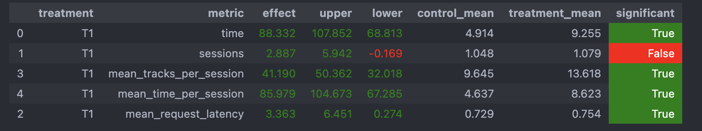

Попробовал различные реализации с использованием истории прослушивания, но лучшие результаты показала достаточно простая модель:

## Основная идея 
Рекомендовать треки похожие на те, что пользователь прослушал до конца, либо какие-то из топа популярных.

## Реализация
Если время прослушивания трека > 0.95 - рекомендуем пользователю трек похожий на прослушанный при помощи нейросетевого рекомендера. В альтернативном случае рекомендуем трек из топ-50.

## Результат

#### В алгоритме запуска изменений не произошло